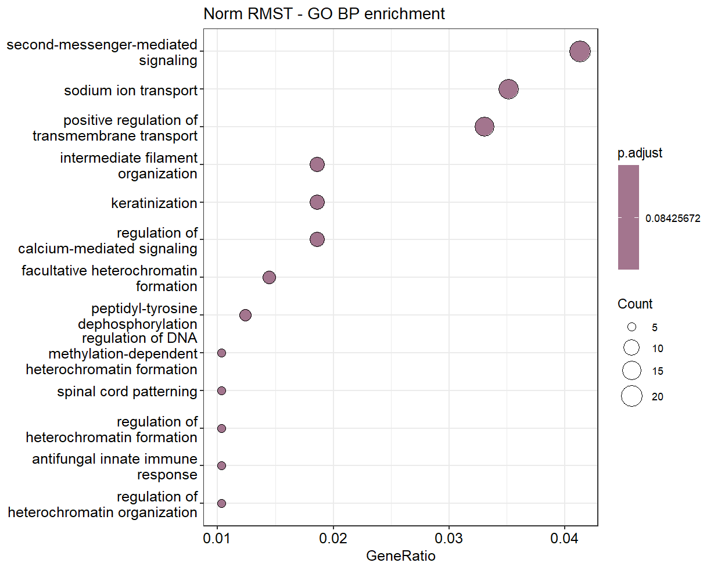

# Исследование связывания транскрипционного фактора SOX2 с учетом регуляции lncRNA RMST (ChIP-Seq, chr12)

**Автор: Наталия Кропивницкая**

## Исходные данные:
Выбрана хромосома: chr12\
Экспериментальные образцы (из статьи https://doi.org/10.1016/j.molcel.2013.07.017):

### SRR945975 
- **Name**: input
- **Organism**: Homo sapiens
- **Strategy**: ChIP-Seq
- **Cell type**: differentiating neural culture
- **Cell line**: ReN-VM
- **treatment**: input - no treatment
- **chip antibody**: none

### SRR945976
- **Name**: si-NT SOX2 ChIP
- **Organism**: Homo sapiens
- **Strategy**: ChIP-Seq
- **Cell type**: differentiating neural culture
- **Cell line**: ReN-VM
- **treatment**: non-targeting siRNA
- **chip antibody**: Santa Cruz SOX2 (sc-17320)

### SRR945977
- **Name**: si-RMST SOX2 ChIP
- **Organism**: Homo sapiens
- **Strategy**: ChIP-Seq
- **Cell type**: differentiating neural culture
- **Cell line**: ReN-VM
- **treatment**: RMST siRNA
- **chip antibody**: Santa Cruz SOX2 (sc-17320)

## Методы и ход работы:

<pre> ```python 
# Подготовка окружения со всеми необходимыми библиотеками:
source /gpfs/vigg_mipt/kropivnitskaya/miniconda3/bin/activate
conda create -n hw3 -c bioconda bowtie2 macs2 homer sra-tools fastqc trim-galore samtools bedtools -y

# Скачивание данных из SRA:
for srr in SRR945975 SRR945976 SRR945977; do prefetch $srr; done
for srr in SRR945975 SRR945976 SRR945977; do fasterq-dump $srr; done

# Контроль качества FASTQ файлов:
for fastq in SRR945975.fastq SRR945976.fastq SRR945977.fastq; do fastqc $fastq; done

# Подготовка референсного генома (chr12):
wget http://hgdownload.soe.ucsc.edu/goldenPath/hg38/chromosomes/chr12.fa.gz
gunzip chr12.fa.gz
bowtie2-build chr12.fa chr12

# Выравнивание ридов на chr12:
bowtie2 -x hg38_chr12/chr12 -U SRR945975.fastq -S input.sam
bowtie2 -x hg38_chr12/chr12 -U SRR945976.fastq -S norm_RMST.sam
bowtie2 -x hg38_chr12/chr12 -U SRR945977.fastq -S depr_RMST.sam

# Конвертация SAM → BAM:
samtools view -Sb input.sam > input.bam
samtools view -Sb norm_RMST.sam > norm_RMST.bam
samtools view -Sb depr_RMST.sam > depr_RMST.bam

# Конвертация BAM → BED:
bedtools bamtobed -i input.bam > input.bed
bedtools bamtobed -i norm_RMST.bam > norm_RMST.bed
bedtools bamtobed -i depr_RMST.bam > depr_RMST.bed

# Macs2 для вызова пиков при сравнении ридов контрольного образца и исследуемых (normal RMST, deprecated RMST):
macs2 callpeak -t norm_RMST.bed -c input.bed -g hs -n norm_RMST.macs2
macs2 callpeak -t depr_RMST.bed -c input.bed -g hs -n depr_RMST.macs2

# Поиск мотивов SOX2 (HOMER) по полученным сгенерированным пикам:
findMotifsGenome.pl norm_RMST.macs2_peaks.narrowPeak hg38_chr12/chr12.fa homer_chr12
findMotifsGenome.pl depr_RMST.macs2_peaks.narrowPeak hg38_chr12/chr12.fa homer1_chr12

# Проверка количества пиков:
(hw3) [kropivnitskaya@n7 hw3]$ wc -l norm_RMST.macs2_peaks.narrowPeak
2010 norm_RMST.macs2_peaks.narrowPeak
(hw3) [kropivnitskaya@n7 hw3]$ wc -l depr_RMST.macs2_peaks.narrowPeak
1369 depr_RMST.macs2_peaks.narrowPeak
``` </pre>
На этапе контролья качества оказалось, что качество хорошее и дополнительный тримминг не требуется. 

#### Рисунок 1. FasqQC для SRR945975


#### Рисунок 2. Топ-5 мотивов для образца norm_RMST


В нормальных условиях (образец norm_RMST) длинная некодирующая РНК RMST связывается с транскрипционным фактором SOX2 и помогает ему находить правильные сайты связывания на ДНК. Это подтвердилось: в файле norm_RMST.macs2_peaks.narrowPeak был найден мотив SOX2 среди top-5 в knownResults.

#### Рисунок 3. Топ-5 мотивов для образца depr_RMST


Когда же RMST было заглушено (depr_RMST), SOX2 потерял специфичность к своим целевым сайтам. В файле depr_RMST.macs2_peaks.narrowPeak мотив SOX2 уже не встречается среди обогащенных мотивов. Вместо этого появились другие неспецифичные мотивы или фоновые последовательности.

## Дополнительное задание
### Сопоставление пиков с генами (аннотация ChIP-пиков)
Целью является выявление, с какими генами связаны найденные пики SOX2. Для этого используют функции вроде makeChIPGeneDB из пакета TFEA.ChIP (в R). Логика следующая: пик из narrowPeak перекрывает промотор гена SOX3 - значит этот пик аннотируется к SOX3.

### GSEA-анализ (анализ обогащенности генов)
После аннотации пиков получаем список генов. Теперь можно сделать GSEA и ответить на следующие вопрос, какие биологические процессы/сигнальные пути связаны с этими генами.

#### Рисунок 4. Скрипт для анализа обогащенности генов


#### Рисунок 5. Графики GO Biological process enrichment для norm_RMST и depr_RMST



